# Akıllı Etkinlik Planlama 

## İçindekiler

- [Genel Bakış](#genel-bakış)
- [Özellikler](#özellikler)
- [Kullanılan Teknolojiler](#kullanılan-teknolojiler)
- [Veritabanı Şeması](#veritabanı-şeması)
- [Uygulama Görselleri](#uygulama-görselleri)

---

## Genel Bakış

Akıllı Etkinlik Planlama Uygulaması, kullanıcıların etkinlikler oluşturabileceği, yönetebileceği ve diğer kullanıcılarla etkileşim kurabileceği modern bir etkinlik yönetim platformudur. Etkinlik takvimi, mesajlaşma sistemi ve kullanıcı puanlama gibi özelliklerle kullanıcı deneyimini zenginleştirir.

---

## Özellikler

- **Etkinlik Oluşturma ve Yönetimi**
- **Etkinlik Takvimi**
- **Etkinliklere Katılma**
- **Kullanıcı Puanlama Sistemi**
- **Etkinlik Önerileri**
- **Mesajlaşma Sistemi**

---

## Kullanılan Teknolojiler

- **Python (Flask)**
- **PostgreSQL**
- **HTML/CSS**
- **Google Maps API**

---

## Veritabanı Şeması

### ER Diyagramı

Aşağıda projenin veritabanı şeması bulunmaktadır:

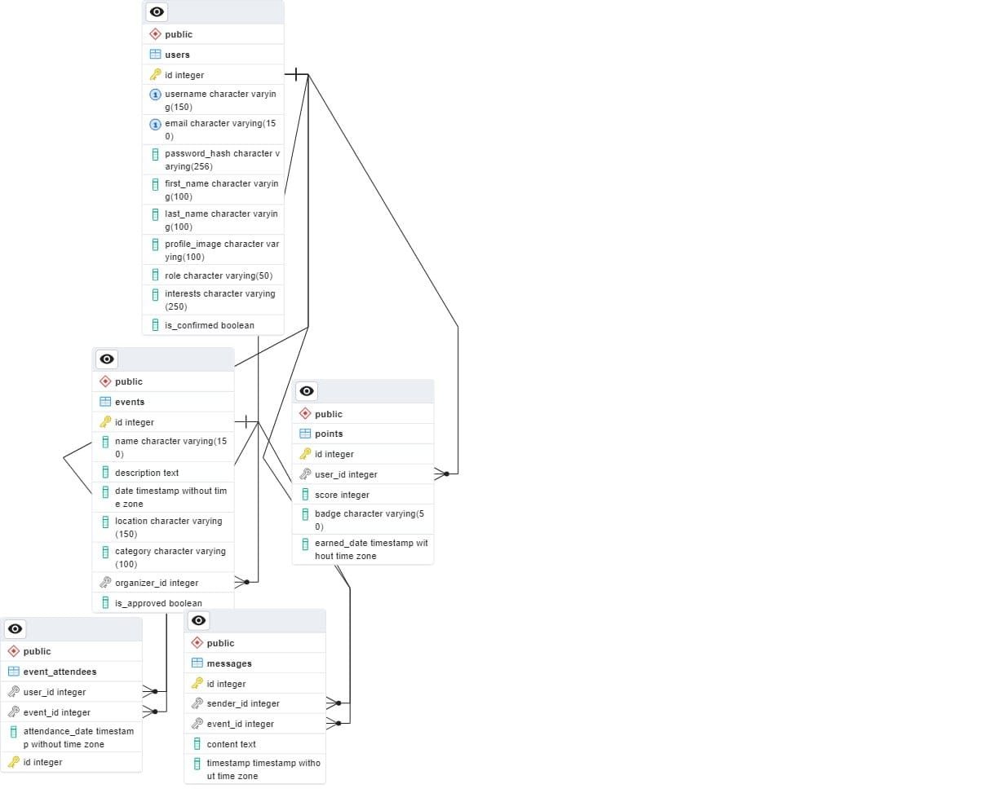

---

## Uygulama Görselleri

### 1. Ana Sayfa
Kullanıcılar etkinlikleri görüntüleyebilir ve filtreleyebilir.

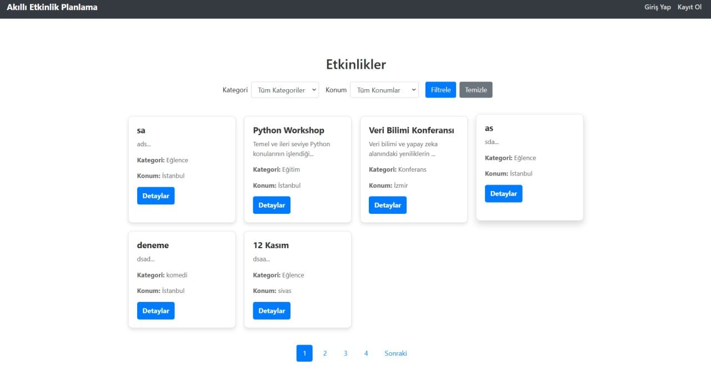

---

### 2. Şifre Sıfırlama
Kullanıcılar e-posta adresleriyle şifrelerini sıfırlayabilir.

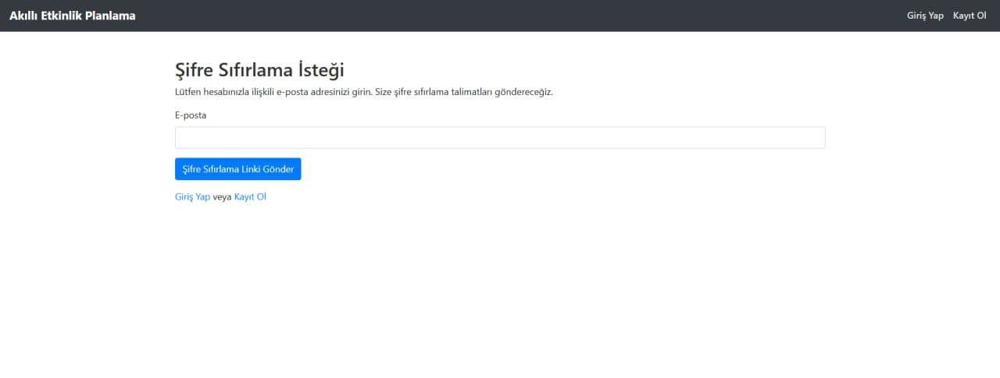

---

### 3. Kullanıcı Listesi
Admin paneli üzerinden kullanıcıların bilgilerini,durumlarını,puanlarını ve işlemleri yönetebilirsiniz.

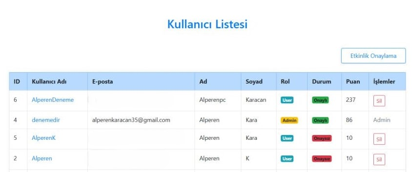

---

### 4. Profil Sayfası
Kullanıcılar profillerini düzenleyebilir ve ilgi alanlarını güncelleyebilir.

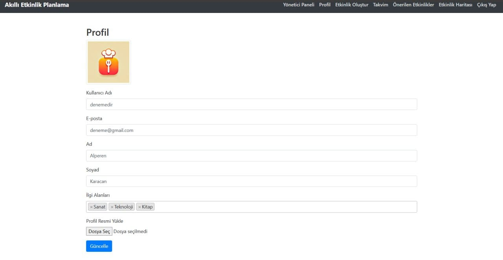

---

### 5. Katıldığınız Etkinlikler ve Puanlar
Kullanıcıların katıldığı etkinlikler ve kazandığı puanlar detaylı olarak listelenir.

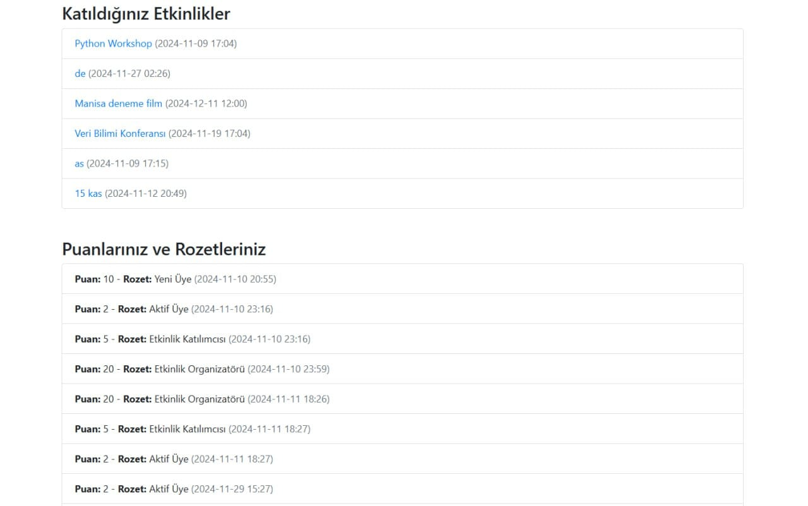

---

### 6. Etkinlik Takvimi
İlgili kullanıcının katıldığı etkinlikler takvim formatında görüntülenebilir.

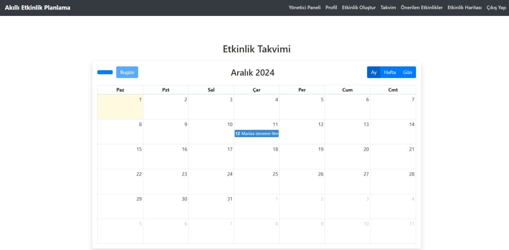

---

### 7. Önerilen Etkinlikler
Kullanıcının ilgi alanlarına göre önerilen etkinliklerin listesi.

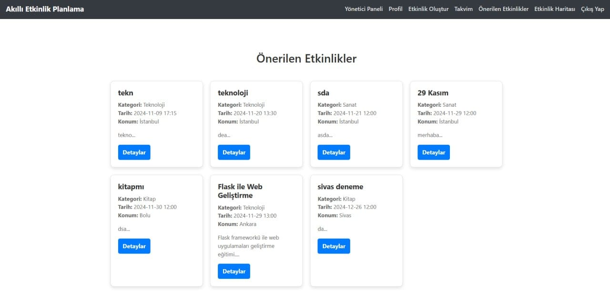

---

### 8. Etkinlik Haritası
Etkinliklerin konumları harita üzerinde görselleştirilir.

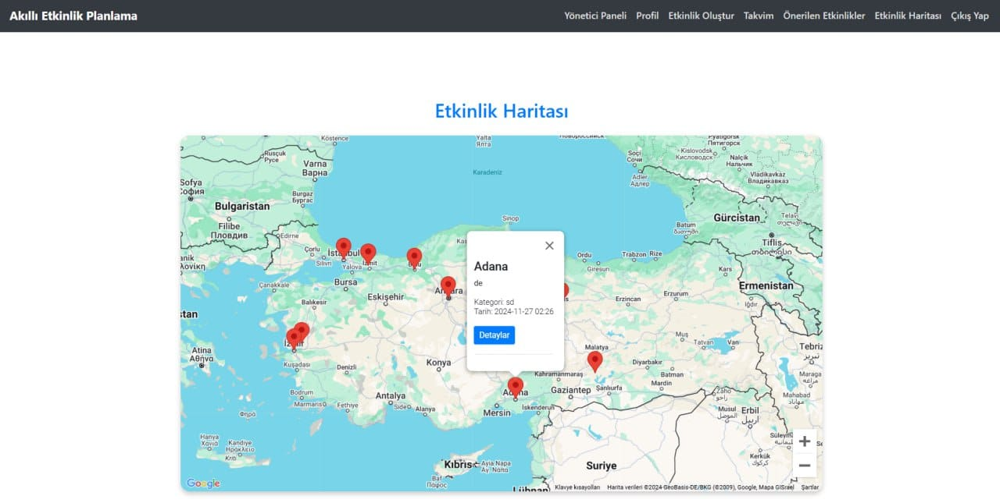

---

### 9. Etkinlik Mesajlaşma
Katılımcılar etkinliklerle ilgili mesajlaşabilir.

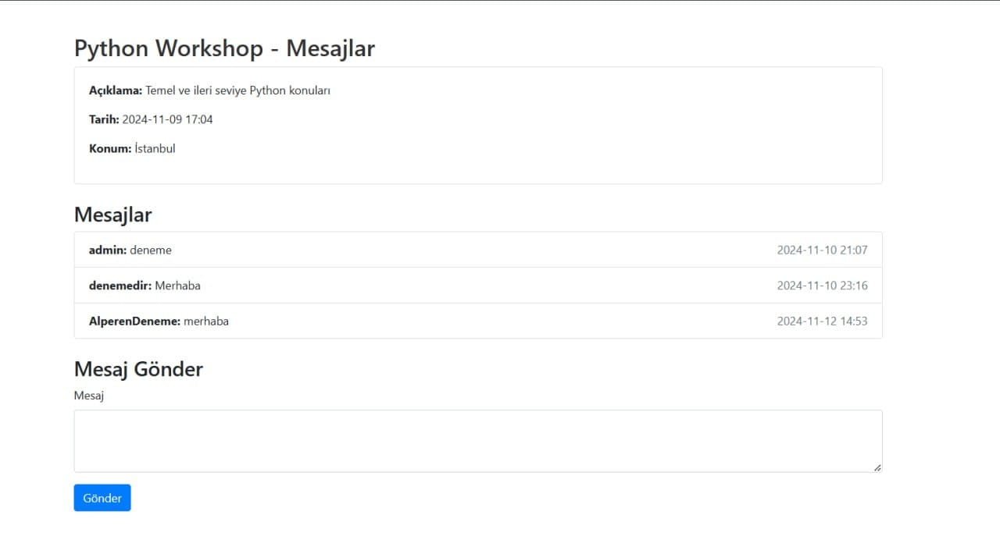

---

### 10. Etkinlik Katılma ve Detayları
Kullanıcılar etkinliklere katılabilir ve ayrıntılarını görüntüleyebilir.

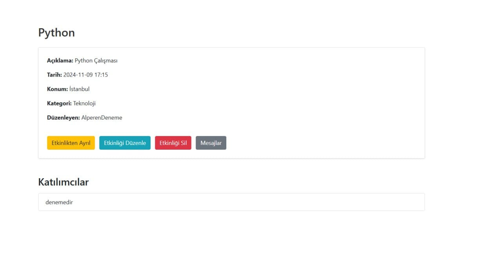

---

### 11. Akış Diyagramı
Uygulamanın akış diyagramı aşağıda verilmiştir:

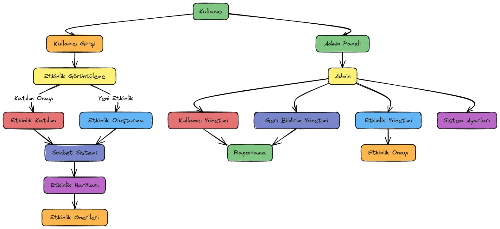

---

